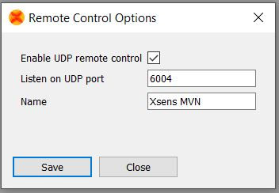
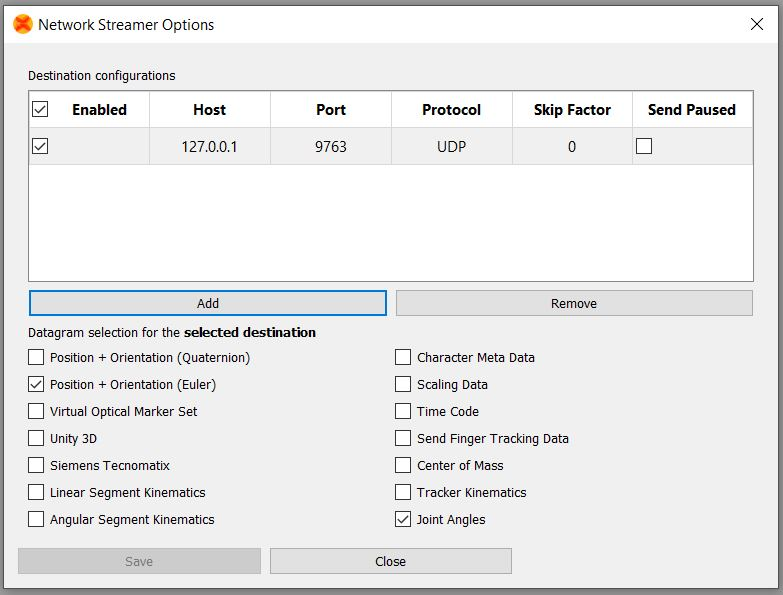

# README #

### What is this repository for? ###

* This repo contains the wireless communication setup of the wearable measurement system. 
* 1.0

### What are required before using this setup? ###

* Xsens Suit (link or Awinda)
* Xsens MVN software and corresponding license key
* Moticon pressure insoles
* Moticon OpenGo mobile App (only works for Android system)
* Moticon EndPoint SDK

### How to set up? ###
* Set up the Xsens Suit and link to the MVN software. Refer to this [video list](https://youtube.com/playlist?list=PLvZN9PInPo3EVsQ0ulQcV7U5eVvOtEdld) for detail steps.
* Turn on the remote control (and the remote data streaming feature if frame by frame data streaming is needed)


* Set up the Moticon insoles inside the OpenGo mobile App. Refer to this [doc](https://account.moticon.com/doc-opengo-app-documentation-overview) for detial steps.
* Set up the python environment for remote control, link the EndPoint SDK and install required packages
	- For windows user (xsens mvn only works on windows so far), [Anaconda](https://www.anaconda.com/) is a good choice.
	- Install protobuf (3.17.2) in the conda environment.
	- place the EndPoint SDK inside this repo folder
* Connect the Mobile phone (for OpenGo app) and the computer host (for python env) into the same sub-network. 
	- It is not recommend to use the University public network, which may have issue of the UDP connnection.
* Check the IP address of the mobile phone (in the setting of OpenGo app) and the computer host.
	- Change accordingly so that they know each others' ip address.
* Run the python code
	- It will stay in idel mode, waiting the insole recording starts.
* Start and stop recording using the OpenGo app. 
	- Python code will lisening the data flow of the Insoles. 
	- Once it detected the data flow, all recording will be started.

### Two modes ###
* XsensMotion_RemoteControl_SychronizedRecording.py : for synchronized recording in each system (Moticon pressure insoles and Xsens MVN software)
* XsensMoticon_FrameByFrameStream_UDP.py: for frame by frame data streaming

### Contribution guidelines ###

* push corrections
* push new modules

### Citation ###
```BibTeX
@article{Wearable_2023,
		author={Wang, Huawei and Basu, Akash and Durandau, Guillaume and Sartori, Massimo},
		title={A wearable real-time kinetic measurement sensor setup for human locomotion}, 
		journal={Wearable Technologies}, 
		publisher={Cambridge University Press}, 
		year={2023}, volume={4}, pages={e11},
		DOI={10.1017/wtc.2023.7}}
```
### Who do I talk to? ###

* Repo owner or admin
* Huawei Wang: huawei.wang.buaa@gmail.com


